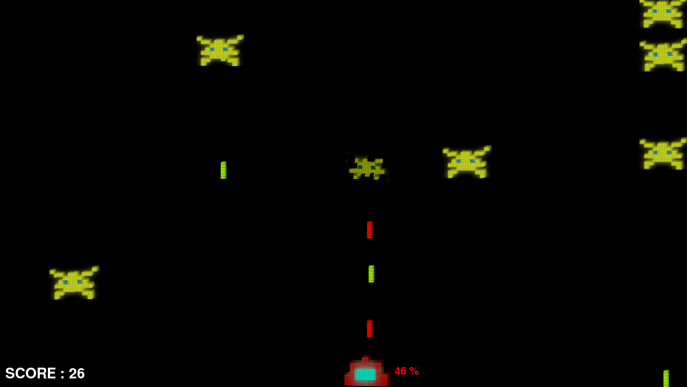

# Shoot them all game

I did this project as part of the **Multimedia** course at Brno University.
We were free to code something using pictures, songs and animations. I decided to make a game.

to play, run in your terminal, from this folder :
```
python res/main.py
```

You can read the full presentation [here](report/report.md).

Screenshot of the game :



<br>

**Note** : I have made another version as a web app. You can check its repo [here](https://github.com/CharlieBrugvin/shoot-them-all-game-webapp). (it is playable online [here](https://invader-2437c.web.app/game))
