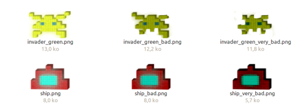
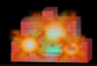
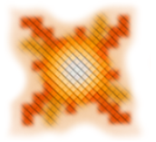

# Shoot them all game : Game and architecture description

## Introduction

For the multimedia project, I have chosen to make a small video game. This is a *beat them all* game, which is inspired from the famous game *space invader*.

The user controls a spaceship with the mouse, which is on the bottom of the application window. He has to shoot as most invaders as possible before he looses all his life. The invaders appear on the top of the window application.

I coded the game in Python 2,7 and Pygame, the most famous graphical library of Python
(http://pygame.org/docs/)

### Concept of the game

The user can shoot a laser to try to kill an invader. When one invader dies, another is automatically
created and will appear on the top of the application window. According to a probability (which
can be changed in the source code) a second invader can appear.

More and more invaders are appearing and if one succeeds to go down enough to go out of the
window application, few points are lost.

Users click on the mouse to shoot and have to avoid the lasers fired randomly by the invaders.
When his life is at 0%, he dies and the amount of point earned is shown.

## Implementation

All the source code is in the folder `/src`

I have coded the game according to a specific structure. It is composed of a source code file named
`main.py`. It contains the main loop of the game.

The project is composed of two classes, which are the Graphic Engine and the Board.

I will give an overview of this structure, but I will not describe in detail all the algorithm and object used.

### Board

The Board contains the whole elements of the game, which are :
- The ship
- A list of invaders
- A list of lasers

All of theses elements are described in their own classes.

The most important function of the board is `update`. This function will update the board according to the inputs (the mouse position and the buttons pressed). It will move each element, find eventual collisions, delete invaders killed, create new lasers, check if it is game over... The object Board represents the state of the game at a given time.

### Graphic Engine

The Graphic Engine is the second most important class. The Graphic engine object of the application contains a pygame surface which represents the game according to the board given in the last call of its function `update(board)`.

The update function takes as parameter a board object, and will enumerate all the elements of the board to add their corresponding pictures of the best place on the surface. After, the function update will handles the events, which are described in the next parts, to produce the goods graphical and sound effects.

### Events

Events are created in the update function of the Board and are stored in a list attribute (which is
erased at the beginning of each update call) . When the spaceship or an invader shoot a laser, when
an invader succeed to go out of the screen, when the spaceship or an invader is touched, an object of
the type Event is added to this list.

But when the update function of the graphic engine is called, this list is copied to its local list event.
And all of the event on this list are enumerated and the graphics or sound effects are added during the
update function.

Each event have a time of existence (in seconds) when this time is finished, the event is erased from
the list.

The Event object has a string attribute type, which represents the type of the event.

### Constants

Most of the constants used in the game, such as the probability of shooting for an invader, the speed
of the invader or of the lasers, or the number of points earned are described in the file
constant.py. The types of events and their duration are also stored here.

It is possible to change the behavior or hardness of the game by changing theses constants.

### Main

The Main.py file contains the main loop of the game. It is necessary to launch this file to launch the
game.

This is what it is doing:

1. Initialization of Pygame
2. Beginning of the loop of the application (while the user doesn't quit):
    1. Creation of the board object, according to the size elements described in the constant file
    2. creation of the graphic engine object, according to the board
    3. creation of the window
    4. the background music is played
    5. the loop of the game begins (while not game over)
        1. call of the function graphicEngine.update(board) and we add grapicEngine.surface to the window
        2. checking of the inputs (quit, right button click, position of the mouse)
        3. call of board.update(inputs)
        4. check if the game is over, in this case we exit the loop of the game
    6. creation of the game over message, presentation of the score
    7. game restarts

## Pygame

I have chosen Pygame because that's the main library of Python to make games. It is relatively easy
to use (Python and Pygame are high level languages). It also manages everything I need: pictures
with canal alpha loaded into surface, PNG is supported, it is possible to modify these surfaces
(rotation, size, ...). Pygame is also able to play a background music and to start songs created from
files.

Pygame supports a lot of different image formats: JPG, PNG, GIF (non animated), BMP, PCF and
even TIF. But I only used PNG format, it is the best in my view for video game's frames, and PNG
supports the alpha canal, for transparency.

All the images used are made by myself and can be found in the folder res.

For the song, Pygame is able to stream MP3, wav, ogg, wma but I only used wav formats because
some bugs happened with the other formats. The music and the sounds used are all from the internet and are free. I edited and converted them in the software Audacity.

### Surfaces

Pygame uses surfaces. A surface is a matrice of pixels. It is possible to blit one surface to another, or to perform some transformations (rotation, zoom,...). The basic idea to create a graphical representation of a board in the graphic engine is to enumerate the elements and to blit them on the background image one after the other.

### Graphics

This is the functions I have used in the graphic engine:
- `pygame.image.load()` to load a picture and create a surface object
- `pygame.Surface()` to create the surface attribute of the graphic engine object
- `surface.fill(R,G,B)` to fill a surface into the corresponding RGB color
- `surface.blit(surface, position)` to blit a surface to another. This function is used everywhere
- `surface = pygame.transform.scale(surface, newSize)` to change the surface's size (zoom effect)
- `surface = pygame.transform.rotate(surface, angle)` to rotate a surface

 ### Interactivity

To give more dynamism to the game, I change the surface of the invader or of the ship according to its life:

When the ship is touched, an addition an event of the type “ship_shooted” is added. The graphic
engine will then play a song once, and add an additional surface on the ship during 0,5 seconds to render that:

And when an invader is shot, this surface is added at its position :

But to give some dynamism, The size and the transparency changes according to the reaming time
of the event. The explosions grows and disappear from the beginning to the end of the event. If we change the time of this event (invader_killed), the transformation speed of the surface will also change.

To give the impression that the invaders are moving, I change a little bit their sizes and their angles according to their position. The coefficient of rotation or size is generated from the *cos* of its own position on the y axis. I took a *cos* function to generate the coefficients because it is cyclic.

### Songs

This is the functions from pygame I use :
- `pygame.mixer.Sound()` to load a sound
- `song.play()` to play a song

Some events will cause a sound, such as the event which happens when the user shoot a laser.

The Event Class contains a flag which is useful for this kind of event. If the graphic engine checks this flag to False, it plays the song and put the flag on True. Like that the song is just played once.